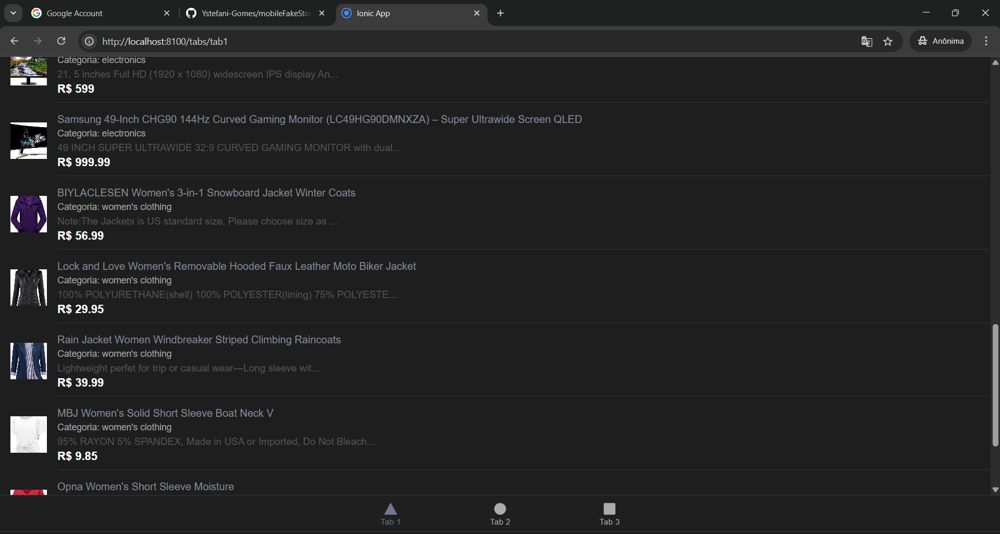

## Descrição do Projeto

Aplicativo móvel desenvolvido com **Ionic** e **Angular** que consome dados da [Fake Store API](https://fakestoreapi.com/). O app simula uma loja online, exibindo produtos, detalhes de cada item e informações do autor do projeto. 

---

## Pré-requisitos

- [Node.js](https://nodejs.org/) (versão recomendada: 18.x ou superior)
- [NPM](https://www.npmjs.com/) (geralmente já vem com o Node)
- [Ionic CLI](https://ionicframework.com/docs/cli)  
  Instale com:  npm install -g @ionic/cli
- [Git](https://git-scm.com/) (opcional, para clonar o projeto)

---

## Como baixar

1. Clone este repositório:
   ```
   git clone <URL-DO-REPOSITORIO>
   ```
2. Acesse a pasta do projeto:
   ```
   cd mobileFakeStore
   ```
3. Instale as dependências:
   ```
   npm install
   ```
4. Execute o projeto em modo desenvolvimento:
   ```
   ionic serve
   ```

---

## Contribuindo com o Projeto

Contribuições são bem-vindas!  
Para contribuir:

1. Faça um fork do projeto.
2. Crie uma branch para sua feature ou correção:
   ```
   git checkout -b minha-feature
   ```
3. Faça suas alterações e commit:
   ```
   git commit -m "Minha contribuição"
   ```
4. Envie para seu fork:
   ```
   git push origin minha-feature
   ```
5. Abra um Pull Request neste repositório.

---

## Autor

- **Nome:** [Ystefani Mariana Gomes]
- **Matrícula:** [01714611]
- **Curso:** [ADS - Noite - 3NB]
---

## Licença

Este projeto está licenciado sob a Creative Commons Attribution 4.0 International (CC BY 4.0)
Você pode compartilhar, copiar, redistribuir e adaptar este projeto para qualquer finalidade, desde que atribua o devido crédito ao autor


## Imagens
## Imagens




